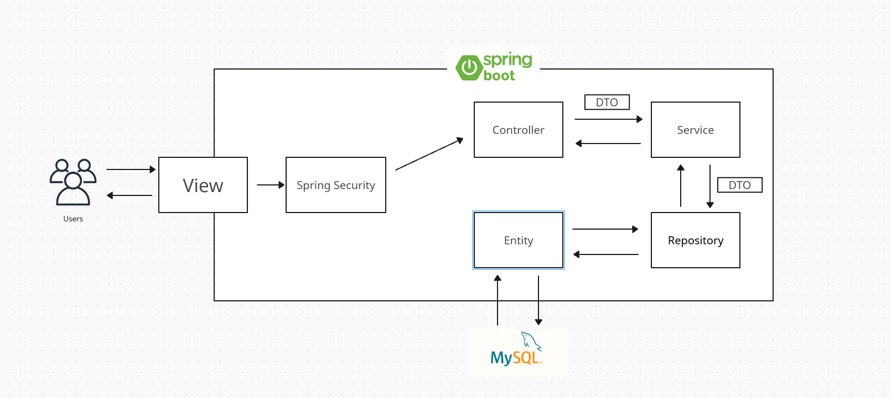
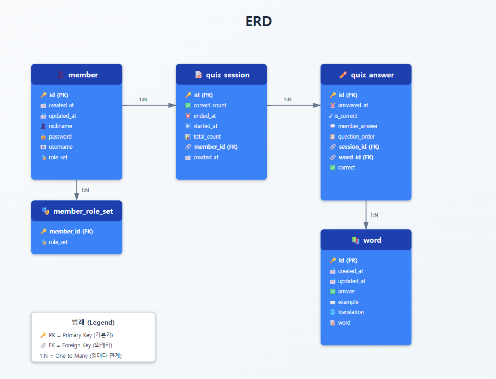
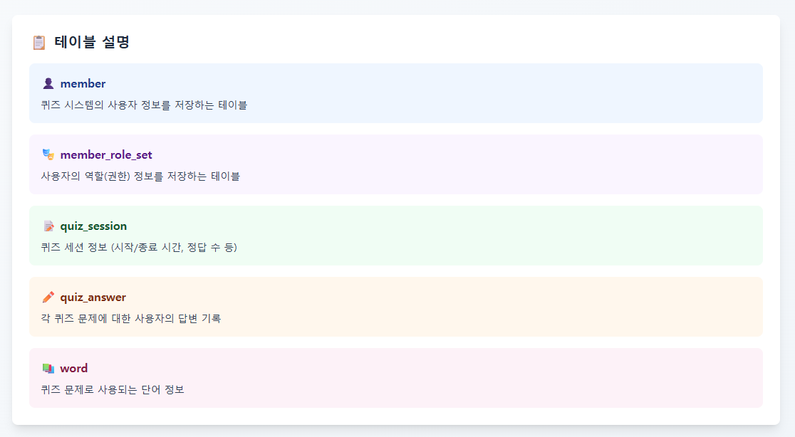

## 영어 단어 맞추기 퀴즈

Spring Boot 기반의 영어 단어 퀴즈 애플리케이션입니다. 사용자는 영어 단어의 의미를 맞추는 퀴즈를 풀고, 결과를 확인하며, 히스토리를 조회할 수 있습니다.

## 📋 목차

- [기술 스택](#-기술-스택)
- [프로젝트 아키텍처](#-프로젝트-아키텍처)
- [ERD 및 테이블 구조](#-erd-및-테이블-구조)
- [프로젝트 설계 및 기능](#-프로젝트-설계-및-기능)
- [API 문서](#-api-문서)

## 🛠 기술 스택

- **Backend**: Spring Boot 4.0.0
- **Language**: Java 17
- **Database**: MySQL
- **ORM**: Spring Data JPA / Hibernate
- **Security**: Spring Security
- **Template Engine**: Thymeleaf
- **Build Tool**: Gradle
- **Lombok**: 코드 간소화

## 프로젝트 아키텍처




## ERD 및 테이블 구조

### ERD



### 테이블 구조 설명



## 프로젝트 설계 및 기능

### 주요 기능

#### 1. 회원 관리
- **회원가입**: 사용자명, 비밀번호, 닉네임으로 회원가입
  - 사용자명과 닉네임은 고유해야 함
  - 비밀번호는 BCrypt로 암호화
- **로그인**: Spring Security 기반 폼 로그인
- **권한 관리**: USER, ADMIN 역할 지원

#### 2. 퀴즈 기능
- **퀴즈 시작**: 문제 개수 선택 (1~50개)
- **퀴즈 진행**:
  - 랜덤 단어 출제
  - 예문과 해석 제공
  - 사용자 답변 입력 및 실시간 정답 확인
- **퀴즈 결과**:
  - 정답률 표시
  - 각 문제별 정답/오답 확인
  - 로그인 사용자는 결과 저장 가능

#### 3. 퀴즈 히스토리
- **히스토리 조회**: 로그인 사용자의 퀴즈 기록 조회
  - 페이지네이션 지원 (페이지당 5개)
  - 날짜, 정답률 등 정보 표시

#### 4. 비회원 지원
- 비회원도 퀴즈 참여 가능
- 단, 결과 저장 및 히스토리 조회는 로그인 필요

### 비즈니스 로직 흐름

#### 퀴즈 진행 흐름

```
1. 사용자가 퀴즈 시작 페이지 접근
   ↓
2. 문제 개수 선택 (1~50개)
   ↓
3. 동적 퀴즈 생성 API 호출
   - 랜덤 단어 선택
   - 문제 순서 지정
   ↓
4. 사용자가 각 문제에 답변 입력
   ↓
5. 실시간 정답 확인 API 호출
   ↓
6. 퀴즈 완료 후 결과 페이지 표시
   ↓
7. (로그인 사용자) 결과 저장 API 호출
   ↓
8. 저장된 세션 ID로 결과 페이지 접근
```

#### 데이터 저장 흐름

```
1. QuizSession 생성
   - 회원 ID (로그인 시) 또는 NULL (비회원)
   - 총 문제 수
   ↓
2. 각 문제별 QuizAnswer 생성
   - Word 참조
   - 사용자 답변
   - 정답 여부
   - 답변 시간
   ↓
3. 트랜잭션 커밋
```

### 보안 설계

- **Spring Security**: 인증/인가 처리
- **BCrypt**: 비밀번호 암호화
- **CSRF 보호**: 개발 단계에서는 비활성화 (운영 시 활성화 권장)
- **세션 기반 인증**: 폼 로그인 방식

## 📡 API 문서

### 회원 관련 API

#### 1. 회원가입
- **URL**: `POST /signUp`
- **Method**: POST
- **Content-Type**: `application/x-www-form-urlencoded`
- **Request Body**:
  ```
  username: string (필수, 고유)
  password: string (필수)
  nickname: string (필수, 고유)
  ```
- **Response**: 리다이렉트 `/`
- **설명**: 새 회원을 등록합니다.

#### 2. 로그인
- **URL**: `POST /signIn`
- **Method**: POST
- **Content-Type**: `application/x-www-form-urlencoded`
- **Request Body**:
  ```
  username: string (필수)
  password: string (필수)
  ```
- **Response**:
  - 성공: 리다이렉트 `/`
  - 실패: 리다이렉트 `/member/signIn` (에러 메시지 포함)
- **설명**: 사용자 로그인을 처리합니다.

### 퀴즈 관련 API

#### 3. 퀴즈 시작 페이지
- **URL**: `GET /quizStart`
- **Method**: GET
- **인증**: 선택 (비회원 가능)
- **Response**: HTML 페이지
- **설명**: 퀴즈 시작 페이지를 표시합니다.

#### 4. 동적 퀴즈 생성
- **URL**: `GET /api/quiz/generate/{questionCount}`
- **Method**: GET
- **Path Parameters**:
  - `questionCount`: int (1~50)
- **Response**:
  ```json
  [
    {
      "wordId": 1,
      "questionOrder": 1,
      "word": "example",
      "example": "This is an example.",
      "translation": "이것은 예시입니다."
    }
  ]
  ```
- **설명**: 지정된 개수만큼 랜덤 퀴즈 문제를 생성합니다. (저장되지 않음)

#### 5. 정답 확인
- **URL**: `POST /api/quiz/check-answer`
- **Method**: POST
- **Content-Type**: `application/json`
- **Request Body**:
  ```json
  {
    "wordId": 1,
    "memberAnswer": "예시"
  }
  ```
- **Response**:
  ```json
  {
    "isCorrect": true,
    "correctAnswer": "example"
  }
  ```
- **설명**: 사용자 답변의 정답 여부를 확인합니다. (저장되지 않음)

#### 6. 퀴즈 결과 저장
- **URL**: `POST /api/quiz/save-results`
- **Method**: POST
- **Content-Type**: `application/json`
- **인증**: 필수 (로그인 필요)
- **Request Body**:
  ```json
  {
    "totalCount": 10,
    "memberId": 1,
    "results": [
      {
        "wordId": 1,
        "questionOrder": 1,
        "memberAnswer": "예시",
        "correct": true
      }
    ]
  }
  ```
- **Response**:
  ```json
  {
    "sessionId": 123
  }
  ```
- **에러 응답**:
  - `401 Unauthorized`: 로그인이 필요함
  - `403 Forbidden`: 자신의 퀴즈 결과만 저장 가능
  - `400 Bad Request`: 잘못된 요청 데이터
- **설명**: 퀴즈 결과를 데이터베이스에 저장합니다.

#### 7. 퀴즈 결과 조회
- **URL**: `GET /quiz/result?sessionId={sessionId}`
- **Method**: GET
- **Query Parameters**:
  - `sessionId`: Long (필수)
- **인증**:
  - 비회원 세션: 인증 불필요
  - 회원 세션: 본인만 조회 가능
- **Response**: HTML 페이지
- **설명**: 저장된 퀴즈 결과를 조회합니다.

#### 8. 저장된 퀴즈 문제 조회
- **URL**: `GET /api/quiz/{sessionId}/questions`
- **Method**: GET
- **Path Parameters**:
  - `sessionId`: Long (필수)
- **Response**:
  ```json
  [
    {
      "id": 1,
      "questionOrder": 1,
      "word": "example",
      "example": "This is an example.",
      "translation": "이것은 예시입니다."
    }
  ]
  ```
- **설명**: 저장된 퀴즈 세션의 문제 목록을 조회합니다.

### 히스토리 관련 API

#### 9. 퀴즈 히스토리 조회
- **URL**: `GET /quiz/history?page={page}`
- **Method**: GET
- **Query Parameters**:
  - `page`: int (기본값: 0)
- **인증**: 필수 (로그인 필요)
- **Response**: HTML 페이지 (페이지네이션 포함)
- **설명**: 로그인한 사용자의 퀴즈 히스토리를 조회합니다. 페이지당 5개씩 표시됩니다.

### 페이지 라우팅

#### 10. 메인 페이지
- **URL**: `GET /`
- **Method**: GET
- **Response**: HTML 페이지
- **설명**: 메인 페이지를 표시합니다.

#### 11. 회원가입 페이지
- **URL**: `GET /signUp`
- **Method**: GET
- **Response**: HTML 페이지
- **설명**: 회원가입 폼을 표시합니다.

#### 12. 로그인 페이지
- **URL**: `GET /signIn`
- **Method**: GET
- **Response**: HTML 페이지
- **설명**: 로그인 폼을 표시합니다.

#### 13. 퀴즈 플레이 페이지 (저장된 세션)
- **URL**: `GET /quiz/play?sessionId={sessionId}`
- **Method**: GET
- **Query Parameters**:
  - `sessionId`: Long (필수)
- **Response**: HTML 페이지
- **설명**: 저장된 퀴즈 세션을 플레이합니다.

#### 14. 퀴즈 플레이 페이지 (동적 생성)
- **URL**: `GET /quiz/play/dynamic?count={count}`
- **Method**: GET
- **Query Parameters**:
  - `count`: int (1~50, 필수)
- **Response**: HTML 페이지
- **설명**: 동적으로 생성된 퀴즈를 플레이합니다.

## 참고사항

- 비회원도 퀴즈를 풀 수 있지만, 결과 저장 및 히스토리 조회는 로그인이 필요합니다.
- 퀴즈 문제는 최대 50개까지 선택 가능합니다.
- 정답은 대소문자 구분 없이 비교되며, 여러 정답이 있을 경우 쉼표로 구분합니다.
- 퀴즈 히스토리는 페이지당 5개씩 표시됩니다.


